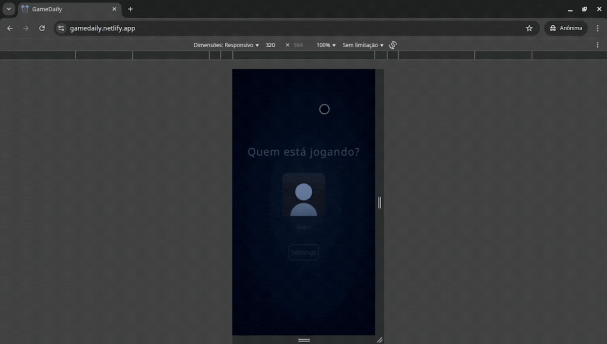
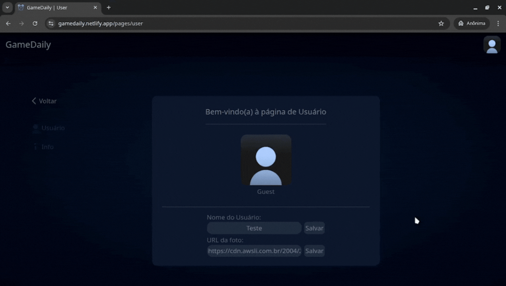

# 🎮 GameDaily 🎮

## Descrição 📕

GameDaily é um site de ancoragem de jogos diários da internet com o intuito de facilitar e deixar mais rápido o acesso dos sites de jogos diários.

## Status 📢 

`Online ✅`

## Funções 🤖

### Responsividade 📱

### Sistema de Favoritos ⭐

### Troca de Nome & Foto 🥸

## Tecnologias 🧑‍🔧

## 🧑‍💻 Desenvolvedor do Projeto

| [ LorhanFigueira](https://github.com/LorhanFigueira) |
| :---: |